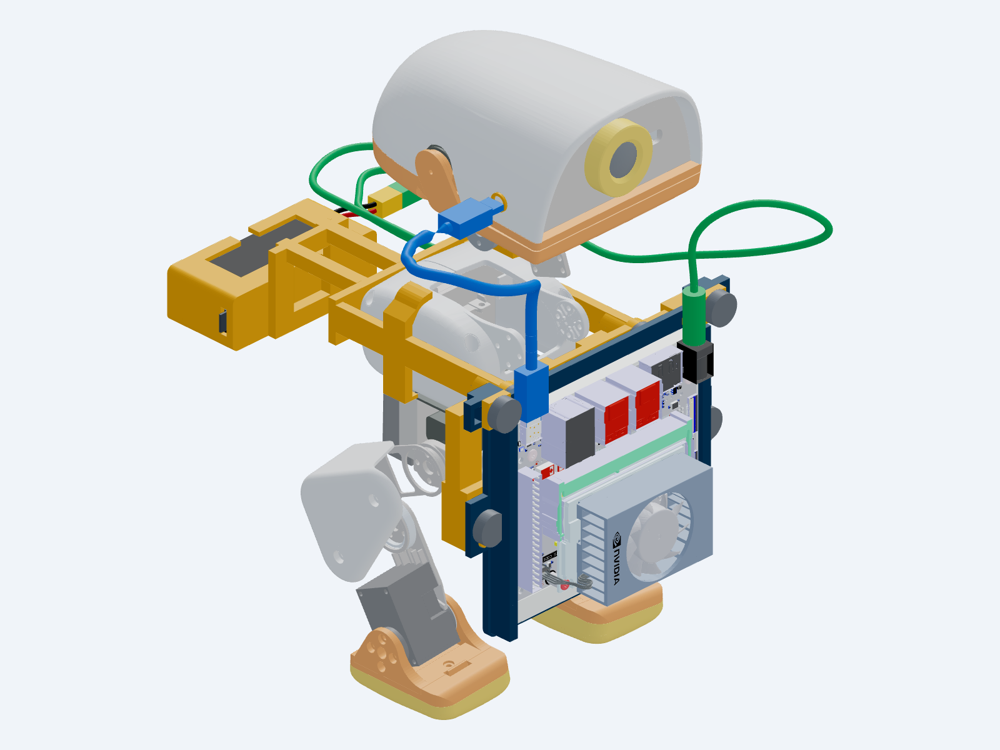
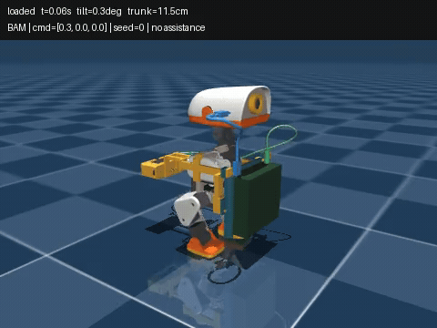

# MicroDuck Jetson Orin Nano mount

Parametric CAD, printable parts, assembled previews and MuJoCo models for an external MicroDuck compute mount. Current design: **v06**, with the Jetson low in front, ports upward, and a **GNB8504S60AHV 4S LiHV 850 mAh battery** behind the torso to balance it.



## Walking policy video

[](https://github.com/adammong/microduck-jetson-mount/blob/main/results/mac-v06/preview-loaded-forward.mp4)

[Watch or download the full MP4](https://github.com/adammong/microduck-jetson-mount/raw/refs/heads/main/results/mac-v06/preview-loaded-forward.mp4). This is the unchanged official walking policy on the loaded v06 model in Mac MuJoCo simulation, with no assistance; it is not a hardware demonstration. The fine-tuned policies remain rejected.

## Start here

- [Assembly, hardware, printing and limitations](easy_mount/README.md)
- [Wiring and compute-board access](easy_mount/WIRING.md)
- [Battery selection and runtime assumptions](easy_mount/battery_selection.json)
- [Complete robot preview](easy_mount/GLB/microduck_easy_mount_v06.glb)
- [Editable CAD assembly](easy_mount/STEP/easy_mount_assembly.step)
- [Five print STLs](easy_mount/STL/)
- [MuJoCo models and validation reports](easy_mount/simulation/)
- [Mac simulation and training](training/README.md) · [v06 simulation findings](results/mac-v06/REPORT.md) · [historical v05 findings](results/mac-v05/REPORT.md)

The estimated payload is **442.1 g**, including **120.1 g** fully dense PETG and estimated ancillary hardware. The battery is specified at **73 g**, with **12.92 Wh** nominal energy. Runtime arithmetic estimates 22–37 minutes at 15–25 W total Jetson draw, including reserve and conversion losses; it does not predict robot motor runtime.

## Prototype status

Physical shell fit, structural strength, power conditioning/protection and hardware walking are unverified. Matched Mac simulations show much less standing drift and a useful forward gait with the existing policy. Survival alone does not prove command tracking: reverse, sideways and turn-in-place remain ineffective. Full joint travel has recorded collisions. The blue USB cable ends at a free, unverified head-side plug; the amber ring is a survey marker, not a stock port. Approximate purchased leads/connectors are illustrated. The larger 1100 mAh pack was researched but has **not** been integrated into this CAD.

## Rebuild

Use Python 3.12. From the repository root:

```sh
python3.12 -m venv .venv
.venv/bin/python -m pip install -r requirements.txt
sh easy_mount/build.sh
.venv/bin/python checks/package_easy_mount.py
```

Only print the five files in `easy_mount/STL/`. Electronics, battery, wires, knobs and straps are purchased components. CAD dimensions are millimeters; MuJoCo uses meters and kilograms.

See [third-party attribution](THIRD_PARTY.md). Upstream robot assets and NVIDIA geometry retain their respective terms.
