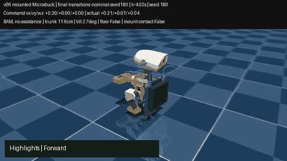
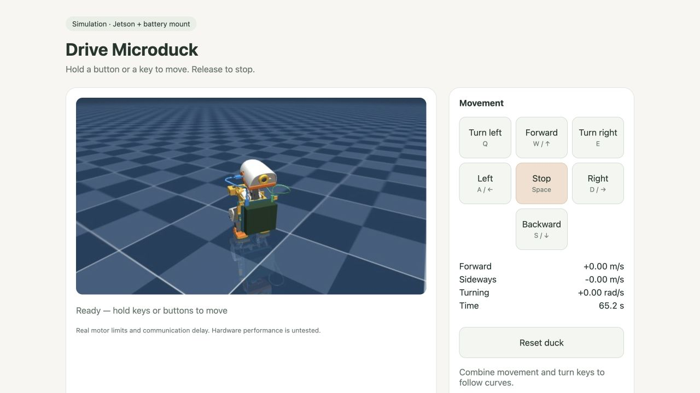

# Directional motion with the v06 Jetson mount

[](motion-demo.mp4)

**Selected simulation policy:** [policy.onnx](policies/selected/policy.onnx). It moves forward, backward and sideways, turns in both directions, follows curves and stops. It retains the official walking network and learns command mapping and bounded IMU feedback. **176/176** fresh 30-second trials survived without detected mount contact or non-foot floor support. **8/8** complete 69-second control sequences also survived and followed every requested direction.

[Full continuous video](motion-demo.mp4) · [second seed](final-transitions-nominal-seed181.mp4) · [frame sheet 180](final-transitions-nominal-seed180.png) · [frame sheet 181](final-transitions-nominal-seed181.png) · [selection](selection.json)

## Control it on the Mac



After [setup](../../training/README.md), run from the repository root:

```sh
OMP_NUM_THREADS=1 tmp/microduck-lab/microduck_local/.venv/bin/python training/teleop_motion.py
```

Open http://127.0.0.1:8798. Hold **W/S** for forward/backward, **A/D** for left/right, **Q/E** to turn. Arrow keys also translate. **Space** stops immediately; releasing keys ramps to a stop. Movement and turn keys combine into curves. Buttons work with mouse/touch. Reset returns to standing; a fall pauses the simulation. The server binds only to this Mac and exits after 15 minutes without input activity.

The command is body-frame `[vx m/s, vy m/s, wz rad/s]`: forward follows the duck's current heading. These controls use tested presets: +0.20/-0.15 m/s forward/backward, ±0.10 m/s sideways, ±0.40 rad/s turning. Translation/yaw acceleration limits are `[0.5, 0.3, 1.5]` in the corresponding units per second. A 0.6-second stale-command watchdog requests a stop. [Limiter](../../training/motion_controller.py) and [interactive simulation](../../training/teleop_motion.py) share the path used by the transition checks.

**Low-speed limitation:** this is a directional prototype at the measured speeds, not accurate continuous speed control. Commands at half the presets can remain in the inherited network's standstill dead zone. Arbitrary joystick magnitudes, all three axes together, disturbances and terrain are not validated. The earlier faster straight-walk policy remains available separately; this controller prioritizes direction control.

## Measurements

Tuple columns are signed body-frame **vx, vy, wz**; linear speeds use m/s and turn rates rad/s. Values average samples after the first two seconds, through the same production command ramp as the control page, without a world-heading hold. Nominal confirmations use fresh seeds **200–207** and noise/randomization confirmations use **220–227**. Calibration used only **0–7**. Every active requested axis delivers at least half its requested signed speed/rate in each individual confirmation trial; survival is checked separately from following a command.

| Motion | Requested twist | Nominal actual twist | Noise + randomized physics actual | Survived 30 s |
|---|---|---|---|---:|
| stop | [0.0, 0.0, 0.0] | +0.000, +0.000, +0.001 | -0.000, -0.000, +0.000 | 16/16 |
| forward | [0.2, 0.0, 0.0] | +0.209, -0.002, -0.006 | +0.207, -0.002, -0.013 | 16/16 |
| backward | [-0.15, 0.0, 0.0] | -0.165, -0.004, -0.005 | -0.159, -0.004, -0.004 | 16/16 |
| left | [0.0, 0.1, 0.0] | -0.001, +0.097, +0.005 | -0.000, +0.095, +0.017 | 16/16 |
| right | [0.0, -0.1, 0.0] | -0.005, -0.099, +0.000 | -0.003, -0.099, +0.001 | 16/16 |
| turn left | [0.0, 0.0, 0.4] | -0.004, -0.003, +0.464 | -0.003, -0.003, +0.470 | 16/16 |
| turn right | [0.0, 0.0, -0.4] | +0.003, -0.002, -0.415 | +0.004, -0.002, -0.414 | 16/16 |
| curve left | [0.15, 0.0, 0.3] | +0.130, +0.004, +0.393 | +0.128, +0.003, +0.386 | 16/16 |
| curve right | [0.15, 0.0, -0.3] | +0.136, -0.003, -0.329 | +0.133, -0.002, -0.329 | 16/16 |
| diagonal left | [0.15, 0.07, 0.0] | +0.132, +0.078, +0.048 | +0.129, +0.077, +0.036 | 16/16 |
| diagonal right | [0.15, -0.07, 0.0] | +0.132, -0.063, +0.017 | +0.127, -0.063, +0.028 | 16/16 |

Full keyboard forward/back + turn combinations also passed **16/16** separate 20-second trials without detected contacts: [keyboard curve checks](keyboard-curves.json).

[Nominal results](final-confirmation-nominal.json) · [Noise + DR results](final-confirmation-noise-dr.json). Randomization uses the pinned harness's mass/inertia/CoM/armature/friction and motor voltage/sag treatment; external pushes stay disabled. The scene's nominal total mass is **1.179337 kg**, including the estimated **442.094 g** mount/Jetson/battery/cable payload. Physics runs at 200 Hz, ONNX at 50 Hz, with honest BAM XL330 limits (1.75 A) and 15–30 ms bus lag. No stronger motors, assistance or floor-support cheat.

The control sequences include stop → forward → stop → backward → sidesteps → turn → walk along the new heading → reverse turn → curves → stop. Nominal seeds **180–183**, randomized seeds **240–243**, all 69 seconds with the same command slew as the page. Each active axis also passes the half-requested-speed direction check in every sequence segment after the initial one-second transition. The largest mean residual translation during a stop segment was **0.0013 m/s**. [Nominal sequences](final-transitions-nominal.json) · [randomized sequences](final-transitions-noise-dr.json). Minimum sampled torso height across confirmations and sequences was **10.8 cm**; both rendered frame sheets were inspected.

## What was learned

Six command-conditioned profiles map the requested twist into a useful gait range of the pinned `alpha_walking.onnx`, then add bounded static/gyro/gravity joint corrections. Profiles blend for combined commands. The yaw input also uses the observed gyro yaw-rate error; absolute world yaw/position and privileged velocity are not actor inputs. Joint corrections are clipped to ±0.12 rad (6.9°). A zero twist reproduces the teacher exactly. The teacher normalizer and neural weights are unchanged, and the final 61-input / 14-output ONNX contains the command map and all feedback, including its simulation-only provenance.

Initial CEM: six profiles × eight generations × 20 candidates, four paired seeds, 12-second trials. Turn refinement: two profiles × 12 generations × 24 candidates, eight paired seeds, 20-second trials. The second candidate passed all 176 constant-command tests but could stall on turns after settling into standing; its policy, transition video and metrics remain **not selected** under `policies/turn-fit` and the initial result filenames. A final turn study trains the same body-twist objective from four seconds of standing, through the production command ramp: two profiles × eight generations × 24 candidates, eight paired seeds, 16-second trials. That settled-start candidate still missed one randomized transition turn and fell in one abrupt-start forward test (175/176 survival). The production ramp prevents that forward failure. Finally, a five-value paired grid calibrates a gyro-based pure-turn start boost on 16 full nominal/randomized control sequences per value; 0.30 is selected with no missed turns in training. This adds yaw-command boost only while the observed gyro is low, using no clock or hidden state. No PPO update or physics strength change is involved.

Searches: [initial](calibration/search.json), [turn fit](turn-refinement/search.json), [settled-start refinement](transition-refinement/search.json), [turn-activation grid](activation-study/search.json). Each retains full candidates, seeded trials and an executed source snapshot. [Selected parameters](policies/selected/parameters.json) · [run manifest](policies/selected/run.json) · [export/physics/watchdog verification](final-verification.json). The verifier compares 1,000 fresh inputs with the numerical policy, checks unchanged teacher tensors/normalization, exact stop behavior, correction bounds, command limits, finite inputs, watchdog stop and unassisted null-control falls.

## Limits and reproduction

These finite tests establish the measured directions in this approximate loaded model. Hardware walking, mount flex/slip, cable forces, motor temperature, battery discharge, terrain and full joint-clearance coverage remain unverified. Contact statistics count forces above 0.05 N at 50 Hz; substep impacts can be missed. The existing full-range CAD collision findings still apply. Abrupt raw-command startup is outside the selected control path: [the retained settled candidate](settled-confirmation-nominal.json) fell on one nominal forward start; [the ramp check](startup-ramp-check.json) reproduced that seed successfully with the production limiter. Both this ramp and the turn-start activation belong to the tested controller. This is fast local prototyping, not hardware-transfer validation. The GIF is a clearly cut highlights reel; the linked MP4 is a continuous rollout at normal simulated time.

```sh
OMP_NUM_THREADS=1 tmp/microduck-lab/microduck_local/.venv/bin/python training/verify_motion.py
OMP_NUM_THREADS=1 tmp/microduck-lab/microduck_local/.venv/bin/python training/evaluate_motion_batch.py --policy results/motion-v06/policies/selected/policy.onnx --out tmp/motion-nominal.json --seeds 8 --seed-start 200 --seconds 30 --slew
OMP_NUM_THREADS=1 tmp/microduck-lab/microduck_local/.venv/bin/python training/evaluate_motion_batch.py --policy results/motion-v06/policies/selected/policy.onnx --out tmp/motion-dr.json --seeds 8 --seed-start 220 --seconds 30 --noise-dr --slew
OMP_NUM_THREADS=1 tmp/microduck-lab/microduck_local/.venv/bin/python training/evaluate_transitions.py --policy results/motion-v06/policies/selected/policy.onnx --out tmp/motion-sequence.json --seeds 4 --seed-start 180 --render
```

For complete recalibration, run `training/tune_motion.py --out tmp/motion-initial`, then `training/tune_motion.py --out tmp/motion-turns --generations 12 --population 24 --seconds 20 --seeds 0 1 2 3 4 5 6 7 --modes turn_left turn_right --init tmp/motion-initial/candidate/parameters.json`, then `training/refine_motion_transitions.py --out tmp/motion-settled --init tmp/motion-turns/candidate/parameters.json`. Then run `training/tune_motion_activation.py --out tmp/motion-activation --init tmp/motion-settled/candidate/parameters.json`. Keep the recorded seeds/defaults and the pinned Mac setup. Attribution: [LICENSE](policies/LICENSE), [NOTICE](policies/NOTICE).
