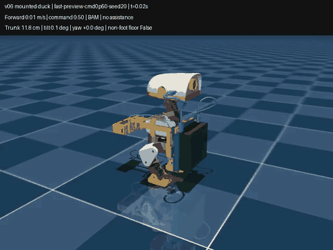

# Faster walking with the v06 Jetson mount

**Selected simulation policy:** [policy.onnx](policies/selected/policy.onnx), forward command `[0.5, 0, 0]`. It covers **0.266 m/s** along the original forward line and averages **0.269 m/s** in the body frame. All **16/16** fresh nominal/randomized forward trials lasted 30 seconds with no detected payload contact or non-foot floor support. The separate start/stop sequence passed **4/4** trials.

[](fast-walking.mp4)

[Full video](fast-walking.mp4) · [second seed](fast-preview-cmd0p50-seed21.mp4) · [frame sheet 20](fast-preview-cmd0p50-seed20.png) · [frame sheet 21](fast-preview-cmd0p50-seed21.png) · [selection metrics](selection.json)

## Measured comparison

Same v06 loaded scene, estimated 1.179337 kg robot total / 442.094 g payload, 200 Hz physics, 50 Hz deterministic ONNX actions, BAM XL330 model with 1.75 A current limit and 15–30 ms command-bus lag. No stronger servos or assist forces. All table trials start from STAND with a fixed forward command, zero head/body commands and fresh seeded models.

| Policy / condition | Command m/s | Survived 30 s | Body forward m/s | Net world-forward m/s | Mean absolute yaw drift | Largest payload-contact time fraction |
|---|---:|---:|---:|---:|---:|---:|
| Teacher: normal walk | 0.30 | 7/8 | 0.159 | 0.147 | 18.2 | 26.5% |
| Teacher: larger command | 0.50 | 8/8 | 0.249 | 0.083 | 124.0 | 0.0% |
| Selected feedback: nominal | 0.50 | 8/8 | 0.269 | 0.266 | 14.1 | 0.0% |
| Selected feedback: noise + DR | 0.50 | 8/8 | 0.276 | 0.271 | 17.3 | 0.0% |

Nominal confirmation uses **seeds 20–27**, which were absent from calibration. Randomized confirmation uses **seeds 40–47**, with observation noise, bus delay and the harness's domain randomization enabled. Results: [teacher](teacher-confirmation-nominal.json), [feedback nominal](feedback-confirmation-nominal.json), [feedback randomized](feedback-confirmation-noise-dr.json). Each aggregate includes all eight trials, including the teacher's early fall. Its seven successful normal-walk trials averaged 0.167 m/s net travel; selected fast walking is **59.1% faster** than that successful-walk average. The larger teacher command alone mostly produces arcs, which is why both body velocity and ground covered are reported.

Randomized trials keep external push disturbances disabled. All four transition trials also returned to effectively zero forward speed during the final second of each stop phase (less than 0.001 m/s in magnitude).

This is **fast walking**. Both-feet-airborne samples occupy about 0.08% of the nominal rollouts; this experiment does not establish a sustained running gait.

## What was trained

Two LAB-launched PPO warm starts ran locally on the Mac: 2,007,040 steps with the original running scorecard, then 3,006,464 steps with stronger speed/gyro-yaw tracking and reduced airtime reward. The second donor's critic was fitted separately to 80 mounted episodes, and its deterministic actor was verified unchanged. Both PPO policies lost net forward progress to circling and remain **rejected**, with resumable checkpoints, normalizers, recipe snapshots, logs and comparisons under [policies](policies/). [Rejected PPO footage](rejected-ppo-preview-cmd0p55-seed0.mp4) shows the turn accumulating despite survival.

Bounded CEM numerical studies then calibrated corrections around the exact original actor. Static offsets improved short trials but failed longer/fresh-seed checks; a 0.75 command produced right-foot/tray contacts. The selected study uses **11 parameters**: six constant joint corrections plus five gains on observable gyro/gravity signals. It optimizes body forward speed and mean gyro yaw rate, rejects falls/non-foot support/payload contacts, penalizes contact time and regularizes correction size. It uses no absolute world-heading input, hidden velocity observation, force assistance or torque-limit change.

Calibration: eight generations × 20 candidates, paired **seeds 0–11**, 25-second trials at command 0.5, fixed reward/fitness throughout. See [complete search](feedback-study/search.json), [source snapshot](feedback-study/tune_snapshot.py) and [selected parameters](policies/selected/parameters.json). The original 61-input / 14-output MLP and its normalization are retained. Added joint corrections are clipped to ±0.08 rad (4.6°). They ramp with raw forward command from 0.35 to 0.45 and are exactly zero for command ≤0.35, including stand, reverse and ordinary 0.3 walking. Other motion commands have not been validated with the fast correction active.

ONNX and numerical-wrapper output agree exactly on the test inputs. The untouched normal/idle path also agrees exactly with the original teacher. The selected ONNX includes its standard 61/14 contract and a simulation-only status. [Verification](feedback-verification.json) includes 1,000 fresh input checks and four 30-second stand → fast → stop → normal → fast → stop sequences (seeds 60–63).

## Scope

These are finite simulation checks, not a hardware-ready controller. Forward command 0.5 is the tested fast operating point; higher commands, turning, uneven terrain and long battery-discharge runs are unvalidated. Contact statistics are sampled at 50 Hz and count forces above 0.05 N; substep impacts can be missed. No detected contacts in these trials do not establish full joint-clearance coverage. Full-range v06 collision findings remain in the mechanical report.

Estimated masses, rigid attachment, fixed cables, approximate payload collision boxes and BAM motor dynamics remain the model's assumptions. Mount flex/slip, lead forces, motor temperature and real print fit are not simulated. The video is a deterministic unassisted MuJoCo rollout on the Mac, at normal simulated time; no heading-hold controller is added for filming.

## Reproduce

After [Mac setup](../../training/README.md), run from the repository root:

```sh
OMP_NUM_THREADS=1 VECLIB_MAXIMUM_THREADS=1 tmp/microduck-lab/microduck_local/.venv/bin/python training/tune_fast_feedback.py --out tmp/repeat-fast-feedback --generations 8 --population 20 --command .5 --seconds 25 --training-seeds 0 1 2 3 4 5 6 7 8 9 10 11
OMP_NUM_THREADS=1 tmp/microduck-lab/microduck_local/.venv/bin/python training/evaluate_speed.py --policy results/speed-v06/policies/selected/policy.onnx --out tmp/recheck-fast.json --commands .5 --seeds 8 --seed-start 20 --seconds 30
OMP_NUM_THREADS=1 tmp/microduck-lab/microduck_local/.venv/bin/python training/evaluate_speed.py --policy results/speed-v06/policies/selected/policy.onnx --out tmp/recheck-fast-dr.json --commands .5 --seeds 8 --seed-start 40 --seconds 30 --obs-noise --domain-rand
```

Pinned inputs and software are in [training inputs](../../training/inputs.json) and the Mac training README. Policy attribution and licensing are in [LICENSE](policies/LICENSE) and [NOTICE](policies/NOTICE).
